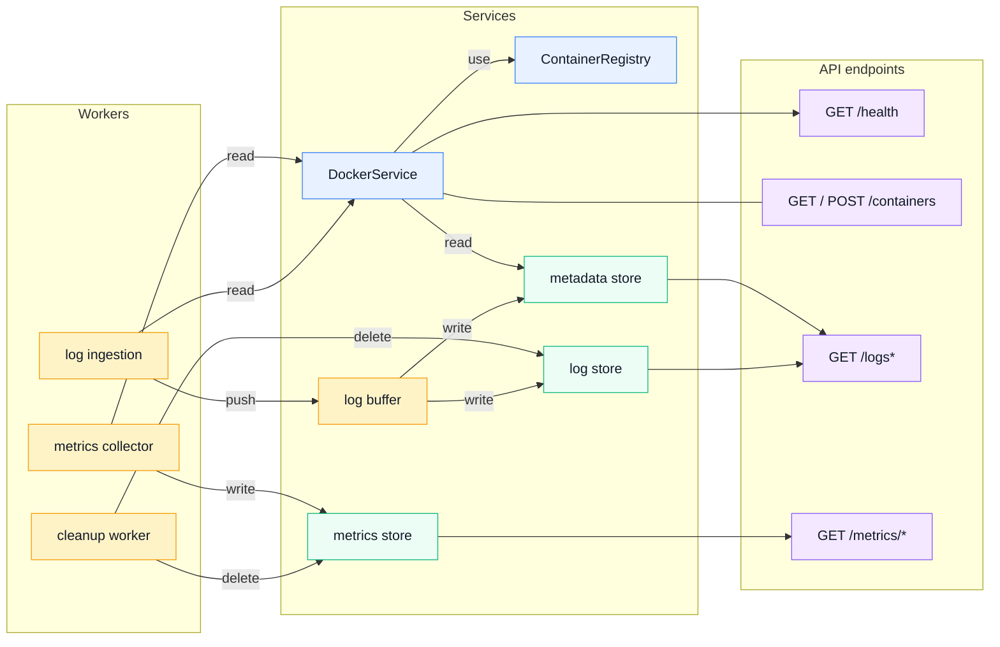

# Architecture overview

## Component responsibilities

- API module: exposes the HTTP endpoints and composes responses from Docker state and persisted data.
- DockerService: the Docker-facing abstraction that provides container lists/details, log streams, samples, and control actions.
- ContainerRegistry: maintains discovered containers and their observed runtime state for DockerService.
- Metrics collector: periodically reads host and container metrics and writes time-series samples to the metrics store.
- Log ingestion: consumes the live Docker log stream and forwards lines into the buffering pipeline.
- Log buffer: batches/debounces log lines before persistence, then writes log rows and metadata updates.
- Metrics store: persists host and container metrics for dashboards and historical queries.
- Log store: persists log entries and supports grouped log retrieval.
- Metadata store: stores log checkpoints/positions and related indexing metadata used by ingestion and Docker resume logic.
- Cleanup worker: periodically removes data older than the configured retention window.

This is the clean backend wiring: the API reads from Docker and the stores, the metrics collector reads from Sysinfo and Docker and writes metrics, and the log ingestion pipeline reads from Docker and writes logs/metadata.
