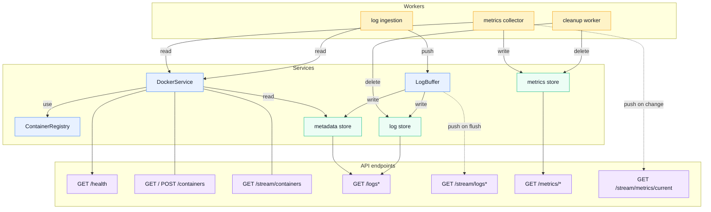
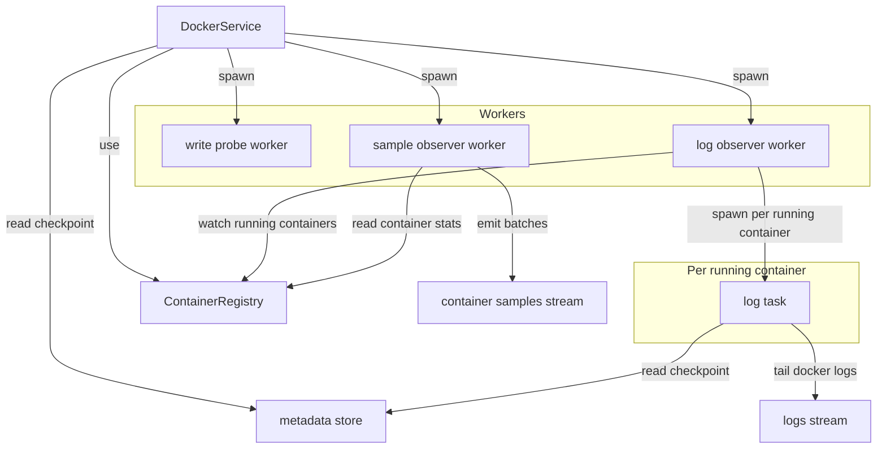
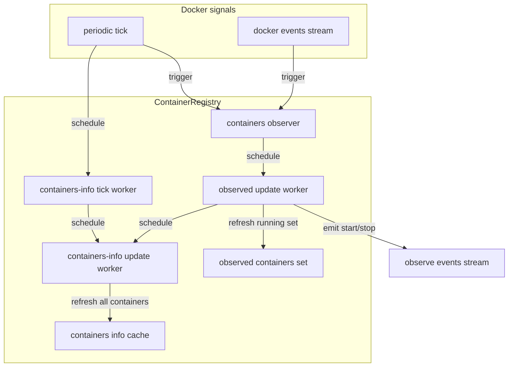
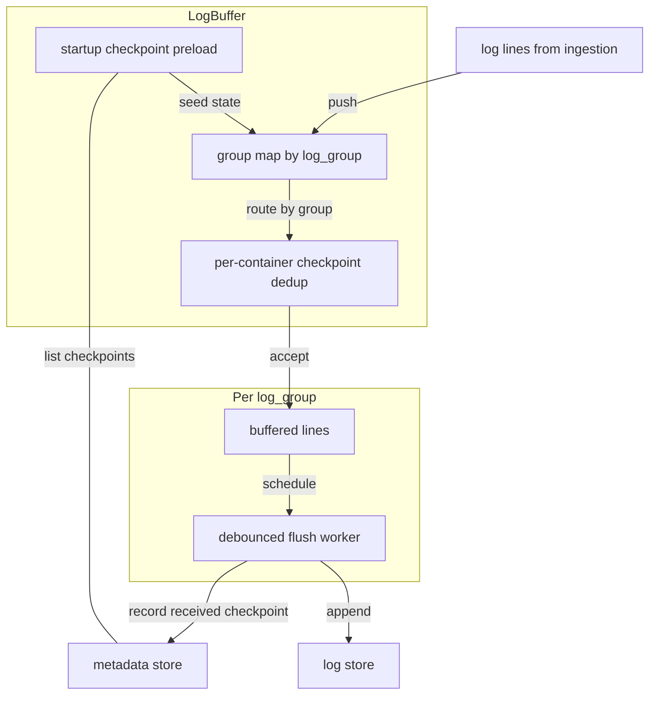

# Architecture overview

- [Architecture overview](#architecture-overview)
  - [Components](#components)
  - [DockerService](#dockerservice)
  - [ContainerRegistry](#containerregistry)
  - [LogBuffer](#logbuffer)

## Components

This diagram shows the high-level backend wiring. It focuses on which components communicate with each other and where data is read, buffered, persisted, and exposed through API endpoints.

- Metrics collector: periodically reads host and container metrics and writes time-series samples to the metrics store.
- Log ingestion: consumes the live Docker log stream and forwards lines into the buffering pipeline.
- Cleanup worker: periodically removes data older than the configured retention window.
- DockerService: the Docker-facing abstraction that provides container lists/details, log streams, samples, and control actions.
- ContainerRegistry: maintains discovered containers and their observed runtime state for DockerService.
- LogBuffer: batches/debounces log lines before persistence, then writes log rows and metadata updates; also bumps a `LogFlushWatcher` signal per group (plus a global one) on every successful flush, driving `GET /stream/logs` and `GET /stream/logs/{log_group}` instead of polling.
- Metrics store: persists host and container metrics for dashboards and historical queries.
- Log store: persists log entries and supports grouped log retrieval.
- Metadata store: stores log checkpoints/positions and related indexing metadata used by ingestion and Docker resume logic.
- API module: exposes the HTTP endpoints and composes responses from Docker state and persisted data.
- `GET /stream/metrics/current` and `GET /stream/containers`: Server-Sent Events push equivalents of `GET /metrics/current` and `GET /containers`. Both are driven by a `tokio::sync::watch` revision counter bumped by the underlying in-memory cache (the metrics snapshot, and the ContainerRegistry's `containers_info` cache respectively) whenever it changes, instead of clients polling on a timer.

This is the clean backend wiring: the API reads from Docker and the stores, the metrics collector reads from Sysinfo and Docker and writes metrics, and the log ingestion pipeline reads from Docker and writes logs/metadata.

## DockerService

This section describes the internal orchestration inside DockerService. Its main responsibility is to bridge Docker runtime signals to internal streams and background workers used by metrics and log pipelines.

- One log worker task is created per currently running container.
- When the set of running containers changes, DockerService reconciles workers: starts new ones for newly running containers and drops finished ones.

## ContainerRegistry

This section describes how ContainerRegistry keeps container state current. It combines periodic refresh and Docker event triggers, then exposes both cached views and observe events for DockerService workers.

- Maintains two views: a fast observed-running set and a broader containers-info cache.
- Coalesces refresh requests with debounce workers to avoid redundant Docker calls.
- Emits start/stop observe events consumed by DockerService log worker orchestration.
- Bumps a `watch::Sender<u64>` revision counter whenever `containers_info` is refreshed; `GET /stream/containers` subscribes to it to know when to recompute and push a diff, instead of polling.

## LogBuffer

This section explains LogBuffer's two primary responsibilities. First, it debounces and batches log writes per group so write load stays stable. Second, it uses checkpoint metadata to drive deduplication and safe backfilling behavior across restarts.

- One flush worker exists per log group, so bursts in one group do not block other groups.
- Startup preloads checkpoints from metadata so dedup and backfill resume logic survive restarts.
- Dedup drops strictly older lines and exact boundary duplicates per container.
- Checkpoint writes are the mechanism that enables safe backfilling without duplicating already persisted lines.
- Flush is debounced and coalesces repeated flush requests before writing.
- On a successful flush, `LogFlushWatcher::notify(log_group)` bumps that group's `watch` channel and a global one; `GET /stream/logs/{log_group}` subscribes per-group to push newly-flushed lines forward, and `GET /stream/logs` subscribes to the global signal (plus `DockerService::subscribe_containers_info()`, since a group's `live` flag depends on container state, not flushes) to push a diff of the groups list.

