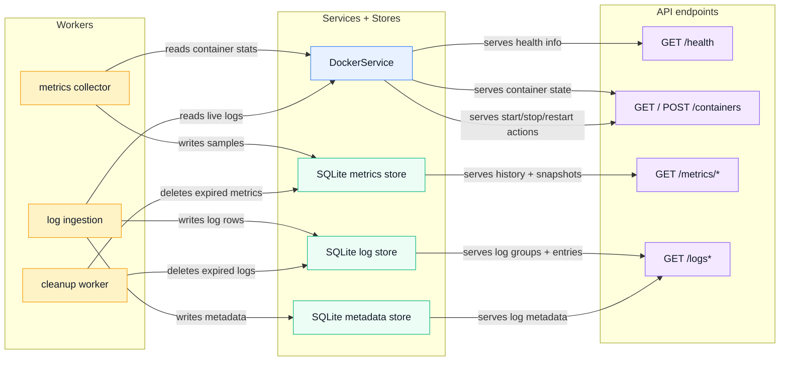

# Architecture overview

## Component responsibilities

- API module: handles health checks, container actions, metrics queries, and log queries by reading from the Docker service and the SQLite stores.
- DockerService: the Docker-facing abstraction; it exposes container data, logs, and control operations, hiding the underlying Bollard implementation.
- Metrics collector: reads host telemetry from Sysinfo and per-container samples from Docker, then writes aggregated metric snapshots to the metrics store.
- Log ingestion: consumes live Docker log streams, batches them through the log buffer, and persists both log entries and their metadata.
- SQLite metrics store: persists time-series host and container metrics used by the dashboard and historical charts.
- SQLite log store: stores log payloads and queryable log data grouped by container or log group.
- SQLite metadata store: keeps the metadata needed to index and organize log data efficiently.
- Storage retention cleanup worker: deletes expired data so the metrics and log databases remain bounded over time.

This is the clean backend wiring: the API reads from Docker and the stores, the metrics collector reads from Sysinfo and Docker and writes metrics, and the log ingestion pipeline reads from Docker and writes logs/metadata.
