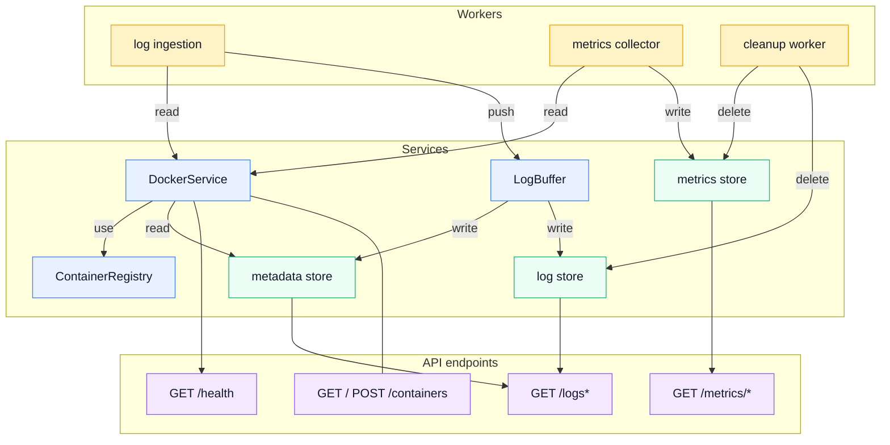
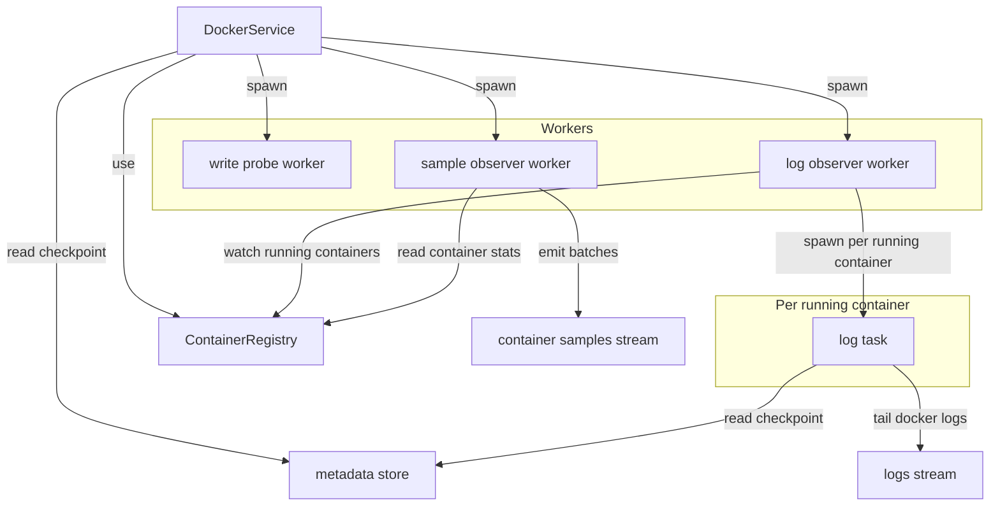
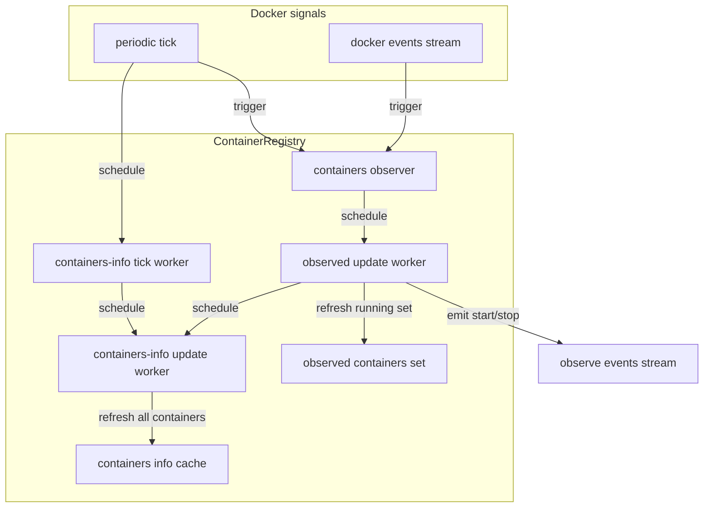
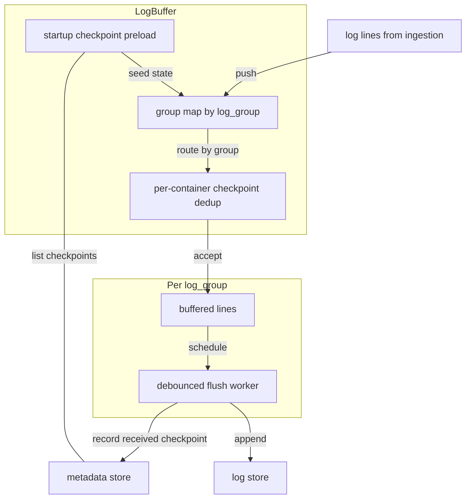

# Architecture overview

- [Architecture overview](#architecture-overview)
  - [Components](#components)
  - [DockerService](#dockerservice)
  - [ContainerRegistry](#containerregistry)
  - [LogBuffer](#logbuffer)

## Components

- Metrics collector: periodically reads host and container metrics and writes time-series samples to the metrics store.
- Log ingestion: consumes the live Docker log stream and forwards lines into the buffering pipeline.
- Cleanup worker: periodically removes data older than the configured retention window.
- DockerService: the Docker-facing abstraction that provides container lists/details, log streams, samples, and control actions.
- ContainerRegistry: maintains discovered containers and their observed runtime state for DockerService.
- LogBuffer: batches/debounces log lines before persistence, then writes log rows and metadata updates.
- Metrics store: persists host and container metrics for dashboards and historical queries.
- Log store: persists log entries and supports grouped log retrieval.
- Metadata store: stores log checkpoints/positions and related indexing metadata used by ingestion and Docker resume logic.
- API module: exposes the HTTP endpoints and composes responses from Docker state and persisted data.

This is the clean backend wiring: the API reads from Docker and the stores, the metrics collector reads from Sysinfo and Docker and writes metrics, and the log ingestion pipeline reads from Docker and writes logs/metadata.

## DockerService

- One log worker task is created per currently running container.
- When the set of running containers changes, DockerService reconciles workers: starts new ones for newly running containers and drops finished ones.

## ContainerRegistry

- Maintains two views: a fast observed-running set and a broader containers-info cache.
- Coalesces refresh requests with debounce workers to avoid redundant Docker calls.
- Emits start/stop observe events consumed by DockerService log worker orchestration.

## LogBuffer

- One flush worker exists per log group, so bursts in one group do not block other groups.
- Startup preloads checkpoints from metadata so dedup survives restarts.
- Dedup drops strictly older lines and exact boundary duplicates per container.
- Flush is debounced and coalesces repeated flush requests before writing.

